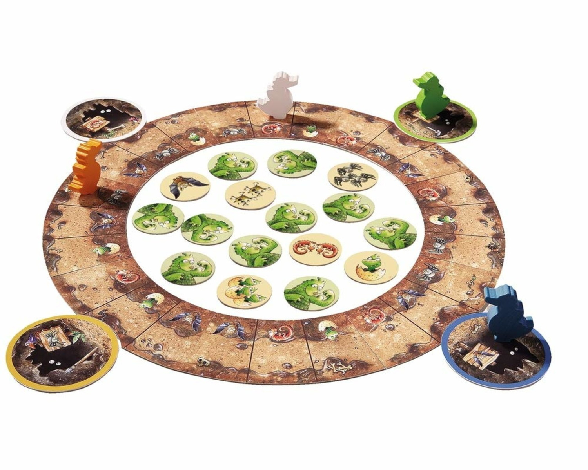

# 🐲 Fiery Dragons Board Game 
## 🎮 Overview
This is a software adaptation of the Fiery Dragons board game, built using **Python’s Pygame** framework. The game follows **object-oriented programming (OOP)** principles, **SOLID** design principles, and **design patterns** to ensure flexibility, maintainability, and reusability.

## 🖼️ Original Board Game

## 📂 Project Structure
- Run **src/game/main.py** to start the game
- **src/game/** – Contains the main game logic  
- **src/memory/** – Stores saved game data
- **docs/** – Contains project documentation
- **images/** – Stores all game images
